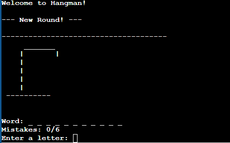

# Proyecto 01: Juego del Ahorcado para Consola

Este proyecto es una implementación en C del clásico juego del "Ahorcado". A diferencia de otros proyectos en mi portafolio, este está diseñado para ejecutarse en una terminal de línea de comandos en un PC, no en un microcontrolador.

El programa utiliza la entrada y salida estándar (`scanf`, `printf`) para interactuar con el usuario.

## Características
*   Un conjunto predefinido de palabras a adivinar.
*   Lógica de juego que rastrea los intentos, fallos y aciertos.
*   Representación visual del ahorcado en arte ASCII que se actualiza con cada fallo.
*   Validación para evitar que el usuario ingrese la misma letra dos veces.
*   Mensajes claros de victoria o derrota al final de cada partida.

## Tecnologías Utilizadas
*   **Lenguaje:** C (Estándar C11)
*   **Sistema de Build:** CMake
*   **Compilador:** GCC / Clang / MSVC

## Cómo Compilar y Ejecutar

El proyecto usa CMake, lo que facilita su compilación en diferentes plataformas (Linux, macOS, Windows).

1.  **Clona el repositorio:**
    ```bash
    git clone https://github.com/tu-usuario/mi-portafolio-programacion.git
    cd mi-portafolio-programacion/standard-c-projects/01-ConsoleHangmanGame
    ```

2.  **Crea una carpeta de build:**
    ```bash
    mkdir build
    cd build
    ```

3.  **Ejecuta CMake para generar los archivos de compilación y compila el proyecto:**
    ```bash
    # Genera los Makefiles (o archivos de proyecto para tu IDE)
    cmake ..

    # Compila el ejecutable
    make
    ```

4.  **Ejecuta el juego:**
    ```bash
    ./Ahorcado
    ```

## Demo de Funcionamiento

